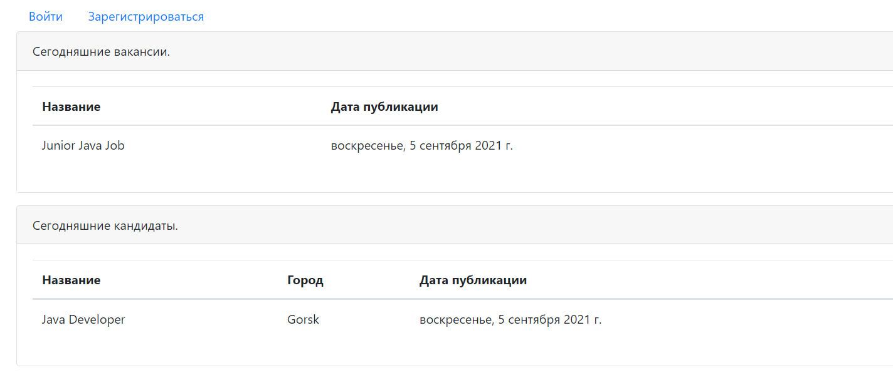
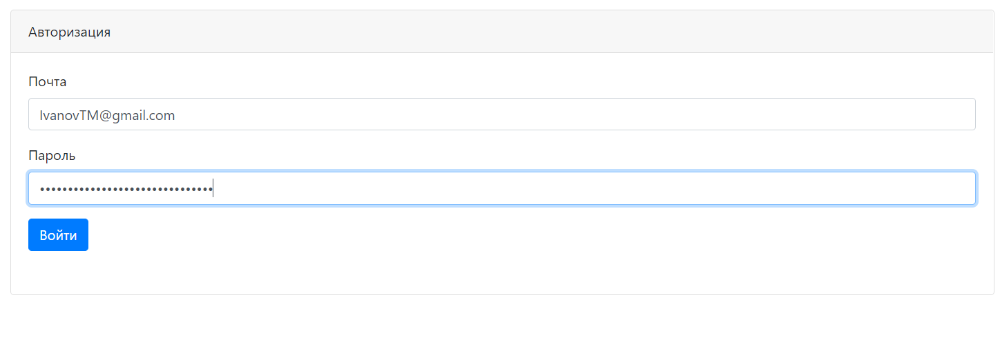

Dreamjob
=============

This project implements a platform for job search by candidates and 
recruitment by companies.

#### Dependencies

* Java 14
* Servlets, Filters
* JSP(JSTL), HTML, JavaScript(JQuery, Ajax), Bootstrap
* JDBC + PostgreSQL
* Liquibase
* Junit, Hamcrest, Mockito, H2
* Maven
* Tomcat
* Log4j, Slf4j
* Travis CI
* Checkstyle

#### Demo

